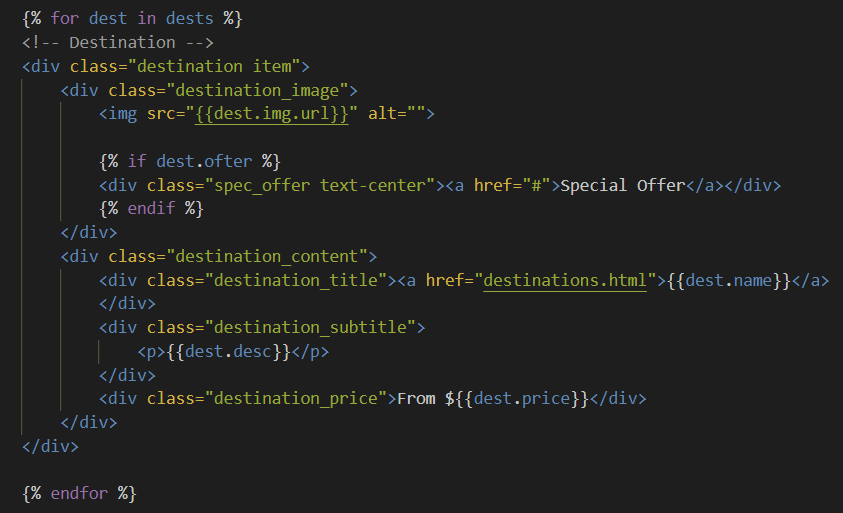
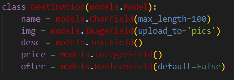
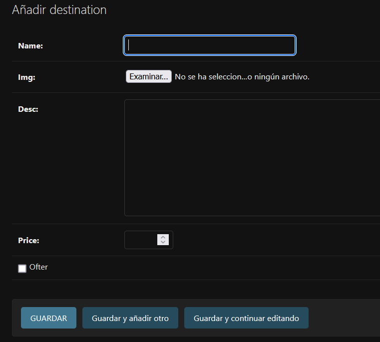
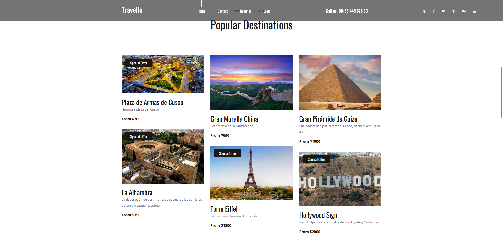

<div>
<table width="1000px">
    <theader>
        <tr>
            <td></td>
            <th>
                <span style="font-weight:bold;">UNIVERSIDAD NACIONAL DE SAN AGUSTIN</span><br />
                <span style="font-weight:bold;">FACULTAD DE INGENIERÍA DE PRODUCCIÓN Y SERVICIOS</span><br />
                <span style="font-weight:bold;">DEPARTAMENTO ACADÉMICO DE INGENIERÍA DE SISTEMAS E INFORMÁTICA</span><br />
                <span style="font-weight:bold;">ESCUELA PROFESIONAL DE INGENIERÍA DE SISTEMAS</span>
            </th>
            <td></td>
        </tr>
    </theader>
    <tbody>
        <tr><td colspan="3"><span style="font-weight:bold;">Formato</span>: Guía de Práctica de Laboratorio</td></tr>
        <tr><td><span style="font-weight:bold;">Aprobación</span>:  2022/03/01</td><td><span style="font-weight:bold;">Código</span>: GUIA-PRLD-001</td><td><span style="font-weight:bold;">Página</span>: 1</td></tr>
    </tbody>
</table>
</div>

<div align="center">
    <span style="font-weight:bold;">INFORME DE LABORATORIO</span><br />
</div>

<div align="center">
    <table width="1000px">
        <theader>
            <tr><th colspan="6">INFORMACIÓN BÁSICA</th></tr>
        </theader>
        <tbody>
            <tr><td>ASIGNATURA:</td><td colspan="5">Programación Web 02</td></tr>
            <tr><td>TÍTULO DE LA PRÁCTICA:</td><td colspan="5">Django - Usando una plantilla para ver Destinos Turísticos</td></tr>
            <tr><td>NÚMERO DE PRÁCTICA:</td><td>06</td><td>AÑO LECTIVO:</td><td>2023 A</td><td>NRO. SEMESTRE:</td><td width="60px">  III  </td></tr>
            <tr><td>FECHA DE PRESENTACIÓN:</td><td>3-06-2023</td><td>HORA DE PRESENTACIÓN:</td><td colspan="3">12:00</td></tr>
            <tr>
              <td colspan="4">NOMBRE:
                <ul>
            	    <li>Hilacondo Begazo Andre Jimmy</li>
                    <li>Layme Mamani Gonzalo Rail</li>
                    <li>Delgado Allpan Andre David</li>
                    <li>Soto ccoya Gabriel Eduardo</li>
                    <li>Chirinos Negron Sebastian Arley</li>
                </ul>
              </td>
              <td>NOTA:</td><td></td>
            </tr>
            <tr>
              <td colspan="6" width="1000px">DOCENTES:
                <ul>
        	        <li>Anibal Sardon Paniagua</li>
                </ul>
              </td>
            </tr>
        </tbody>
    </table>
</div>

# Django

[![License][license]][license-file]
[![Downloads][downloads]][releases]
[![Last Commit][last-commit]][releases]

[![Debian][Debian]][debian-site]
[![Git][Git]][git-site]
[![GitHub][GitHub]][github-site]
[![Vim][Vim]][vim-site]
[![Java][Java]][java-site]

## OBJETIVOS TEMAS Y COMPETENCIAS

### OBJETIVOS

- **Implementar** una aplicación en Django utilizando una plantilla profesional.
- Utilizar una tabla de Destinos turísticos para leer y completar la página web.
- Utilizar los tags “if” y “for” en los archivos html para leer todos los registros de una tabla desde una base de datos.

### TEMAS

- Proyectos de Django
- Aplicaciones en Django
- Plantillas profesionales
- Tags para vistas dinámicas


## CONTENIDO DE LA GUÍA

### MARCO TEÓRICO

- [Documentación de Djando](https://docs.djangoproject.com/es/3.2/)

  - Un framework es una abstracción en la cual se puede reusar código y funcionalidades adaptándolos a nuestras necesidades.
  - Un modelo en un framework se suele referir a los datos y su organización
  - Una vista permite apreciar el resultado de la lectura de una tabla incluida en una página web.

#

## Actividades

1. Crear un proyecto en Django <br>

2. Siga los pasos del video para poder implementar la aplicación de Destinos
  turísticos <br>

3. Use git y haga los commits necesarios para manejar correctamente la aplicación.

<br>

#

## Ejercicios Propuestos

<a href="https://youtu.be/lRqv63LJYKk"><span style="color:red;">Video Corto de explicación</span></a>
[](https://youtu.be/lRqv63LJYKk)


1. Deberán replicar la actividad del video donde se obtiene una plantilla de
   una aplicación de Destinos turísticos y adecuarla a un proyecto en blanco
   Django.

   - En este ejercicio, utilizaremos una plantilla llamada Travello de colorlib. Vamos a personalizarla y explorar todas las funcionalidades que DJango nos ofrece para comprender mejor su funcionamiento.

   

    ```
    * Ejercicio 1 [✔]
    ```

2. Luego trabajar con un modelo de tabla Destinos Turisticos donde se
   guarden nombreCiudad, descripcion Ciudad, imagenCiudad, precioTour,
   ofertaTour (booleano). Estos destinos turísticos deberán ser agregados
   en una vista dinámica utilizando tags for e if.

   - En este ejercicio, utilizaremos los tags for e if para poder agregar los destinos que vayamos añadiendo de manera dinámica.

   

    ```
    * Ejercicio 2[✔]
    ```

3. Crear formularios de Añadir Destinos Turísticos, Modificar, Listar y Eliminar Destinos.

    - En este ejercicio, crearemos los formularios correspondientes.

    

    

    ```
    * Ejercicio 3[✔]
    ```

4. Eres libre de agregar CSS para decorar tu trabajo.

5. Ya sabes que el trabajo con Git es obligatorio. Revisa el avance de la
   teoría Django parte4

    

#


## REFERENCIAS

- https://www.w3schools.com/python/python_reference.asp
- https://docs.python.org/3/tutorial/

#

[license]: https://img.shields.io/github/license/rescobedoq/pw2?label=rescobedoq
[license-file]: https://github.com/rescobedoq/pw2/blob/main/LICENSE
[downloads]: https://img.shields.io/github/downloads/rescobedoq/pw2/total?label=Downloads
[releases]: https://github.com/rescobedoq/pw2/releases/
[last-commit]: https://img.shields.io/github/last-commit/rescobedoq/pw2?label=Last%20Commit
[Debian]: https://img.shields.io/badge/Debian-D70A53?style=for-the-badge&logo=debian&logoColor=white
[debian-site]: https://www.debian.org/index.es.html
[Git]: https://img.shields.io/badge/git-%23F05033.svg?style=for-the-badge&logo=git&logoColor=white
[git-site]: https://git-scm.com/
[GitHub]: https://img.shields.io/badge/github-%23121011.svg?style=for-the-badge&logo=github&logoColor=white
[github-site]: https://github.com/
[Vim]: https://img.shields.io/badge/VIM-%2311AB00.svg?style=for-the-badge&logo=vim&logoColor=white
[vim-site]: https://www.vim.org/
[Java]: https://img.shields.io/badge/java-%23ED8B00.svg?style=for-the-badge&logo=java&logoColor=white
[java-site]: https://docs.oracle.com/javase/tutorial/

[![Debian][Debian]][debian-site]
[![Git][Git]][git-site]
[![GitHub][GitHub]][github-site]
[![Vim][Vim]][vim-site]
[![Java][Java]][java-site]

[![License][license]][license-file]
[![Downloads][downloads]][releases]
[![Last Commit][last-commit]][releases]